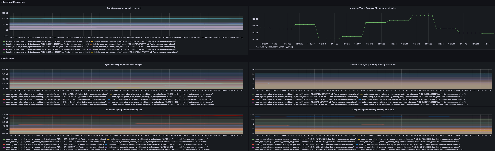
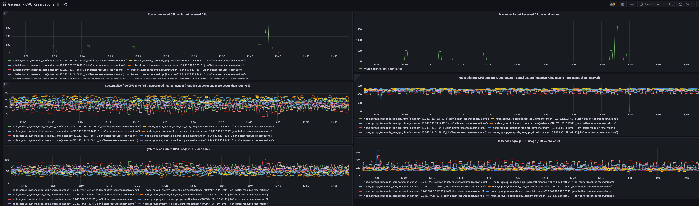

# Better Kubelet Resource Reservations

Recommends memory and CPU kube/system reserved settings based on actual resource consumption.
No more guessing.

**Warning**: This is a PoC!

## Installation

Either via a [single pod](example/installation/pod-better-resource-reservations.yaml) or preferably via a daemonset which can be found [here](example/installation/daemonset-better-resource-reservations.yaml).
The container process will log recommendations to the command line and expose metrics which can be consumed by prometheus (see below for [monitoring example](#exposed-metrics)).

```
time="2021-08-20T04:42:05Z" level=info msg="Available memory from /proc/mem: \"31685712Ki\" (55 percent)"
time="2021-08-20T04:42:05Z" level=info msg="Used memory: \"25928920Ki\" (45 percent)"
time="2021-08-20T04:42:05Z" level=info msg="Kubepods working set memory: \"25805238272\" (44 percent)"
time="2021-08-20T04:42:05Z" level=info msg="System.slice working set memory: \"9752219648\" (17 percent)"
time="2021-08-20T04:42:05Z" level=info msg="RECOMMENDATION: DECREASE reserved memory from \"1Gi\" (2 percent, kube: \"1Gi\", system: \"0\") to \"933292Ki\" (2 percent)"

time="2021-08-20T04:42:05Z" level=info msg="Guaranteed CPU time on this 16 core machine: system.slice:  94.56 percent | kubepods:  1505.44 percent CPU time. \n"
time="2021-08-20T04:41:45Z" level=info msg="CPU usage: system.slice: 54.21 percent. kubepods: 299.36 percent"
time="2021-08-20T04:41:45Z" level=info msg="kubepods CPU shares. Current: 16302 | Target: 29198"
time="2021-08-20T04:41:45Z" level=info msg="RECOMMENDATION: DECREASE reserved CPU from 82 m to 80 m"
```

## Exposed Metrics

Each pod exposes a set of memory and CPU related metrics which can be fed into Prometheus.

**Memory metrics**
- kubelet_reserved_memory_bytes: The kubelet reserved memory in bytes as configured in the kubelet configuration file
- kubelet_reserved_memory_percent: The kubelet reserved memory in percent calculated as (current reserved memory / MemTotal)
- kubelet_target_reserved_memory_bytes: The target kubelet reserved memory calculated as MemTotal - MemAvailable - memory working set kubepods cgroup
- kubelet_target_reserved_memory_percent: The target kubelet reserved memory in percent calculated as (target reserved memory / MemTotal)
- node_cgroup_kubepods_memory_working_set_bytes: The working set memory of the kubepods cgroup in bytes
- node_cgroup_kubepods_memory_working_set_percent: The working set memory of the kubepods cgroup in percent of the total memory
- node_cgroup_system_slice_memory_working_set_bytes: The working set memory of the system slice cgroup in bytes
- node_cgroup_system_slice_memory_working_set_percent: The working set memory of the system slice cgroup in percent of the total memory
- node_memory_MemTotal: The MemTotal from /proc/meminfo
- node_memory_MemAvailable: The MemAvailable from /proc/meminfo
- node_memory_MemAvailable_percent: The MemAvailable in percent of the total memory
- node_memory_used: The not reclaimable memory calculated from /proc/meminfo MemTotal - MemAvailable. (unlike measurement from root memory cgroup)
- node_memory_used_percent: The not reclaimable memory in percent calculated from /proc/meminfo MemTotal - MemAvailable. (unlike measurement from root memory cgroup)


**CPU metrics**
- node_cpu_usage_percent: The overall CPU usage based on /proc/stats
- node_cgroup_system_slice_min_guaranteed_cpu: The minimum guaranteed CPU time of the system.slice cgroup based on the cpu.shares (1024)
- node_num_cpu_cores: The number of CPU cores of this node
- node_cgroup_kubepods_cpu_percent: The CPU consumption of the kubepods cgroup in percent of the last 10 seconds
- node_cgroup_system_slice_cpu_percent: The CPU consumption of the system.slice cgroup in percent
- node_cgroup_system_slice_free_cpu_time: The freely absolute available CPU time for the system.slice cgroup in percent (100 = 1 core)
- node_cgroup_kubepods_free_cpu_time: The freely absolute available CPU time for the kubepods cgroup in percent (100 = 1 core)
- kubelet_target_reserved_cpu: The target kubelet reserved CPU
- kubelet_current_reserved_cpu: The current kubelet reserved CPU

An already configured monitoring stack for these metrics with Prometheus and tailored Grafana dashboards can be found [here](example/monitoring).

Example memory dashboard:


Example CPU dashboard:



## Problem statement:

The amount of CPU & memory the kubelet, the container runtime and OS processes consume cannot be predicted before node creation.

The memory and CPU consumption depends on the 
- number of pods deployed 
- kind of workload deployed (in pods)
  
This has been observed on various Kubernetes landscapes.
The exact cause should also be investigated outside of this PoC. 

**Problem**: Given these two variables are unknown, any prediction for `kube-` & `system-reserved` will
either **under** or **over-reserve** resources.
  
## Over-reserving resources

**Over reserving memory.**

Default kubelet configuration
```
enforceNodeAllocatable:
- pods
```

This means that memory limits are enforced on the `kubepods` cgroup.
Over reserving memory means a low memory limit on the `kubepods` cgroup, thus less memory can be requested
by pods -> waste of resources -> higher costs.

**Over reserving CPU.**

Over-reserving cpu is not problematic.

**Reason**: Linux allows exceeding the "fair share" of CPU time. 
If the `kubepods` slice runs out-of `cpu.shares`, free cpu shares from other cgroups (such as from system.slice) 
can be allocated.

This means the processes in `kubepods` can exceed the allotted CPU time in case the kubelet and container runtime 
in `system.slice` cgroup need less than their `cpu.shares`.

The only negative side is during scheduling of pods as it seems that less resources are available to pod processes as 
there really is.

## Under-reserving resources

**Under reserving memory.**

Under reserving memory is more problematic than over-reserving memory as it  threatens node stability.
Even though calculated based on machine-type, the formula by GKE & Azure does in my tests
not reserve enough resources.

**Consequence**: under reserving memory will cause a "global" OOM instead of hitting cgroup memory limit (cgroup-OOM) 
or kubelet eviction is triggered (eviction is only triggered if kubepods cgroup is close to its memory limit).
A "global" OOM can kill any process in the OS based on oom_score (also e.g container runtime & kubelet).

**Under reserving CPU.**

Under reserving can only be a problem during resource-contention due to the design of cpu.shares (see above)

Under-reserving CPU in case of resource contention is dangerous.
CPU shares are calculated relative to the other cgroups, so over reserving CPU shares for the kubepods 
slice means under reserving CPU shares for any other cgroup (e.g system.slice).
**Consequence**: The Kubelet, container runtime & OS processes might not get enough CPU time.

# Goal of this PoC

**Goal #1**
Recommend reserved resource (memory, CPU) based on the actual resource consumption of the system.
This is done periodically, as the resource consumption of the kubelet, container runtime
and other non-pod processes changes over time.

Idea:
- Proper reserved resources lead to better pod-scheduling decisions.
- Avoid the problems with `over-` and `under-` reservation of resources (especially to prevent "global" OOM).
  Instead, the kubelet eviction or cgroup-level OOM should be triggered.
  
**Goal #2**

Experiment with updating the kubelet config file and restarting the kubelet process based on the recommendations.
This updates the memory limit and `cpu.shares` of the kubepods cgroup when the kube-reserved is updated and the
kubelet restarted.
**Please be careful when using this option.**

## Terminology

- `/proc/meminfo` "MemAvailable" is the total OS memory available without going into swapping
  Calculated from MemFree, SReclaimable, the size of the file LRU lists, and the
  low watermarks in each zone. The estimate takes into account that the system needs
  some page cache to function well, and that not all reclaimable slab will be reclaimable,
  due to items being in use.
- `/proc/meminfo` "MemTotal" total physical memory available on the system.

`working_set_bytes` is the "working set memory" of a process / cgroup
this is the memory in active use that cannot be evicted in case of resource contention
calculated on cgroups as memory.usage_in_bytes - memory.stat "total_inactive_file"
"total_inactive_file" is the amount of Linux Page cache on the inactive LRU list (e.g, files not recently accessed)

## Calculation of target reserved memory

`kube-reserved memory = MemTotal - MemAvailable  - working_set_bytes for kubepods cgroup`

The kube-reserved should stay rather constant, unless processes outside the kubepods cgroup need more memory (e.g OS daemons, container runtime, kubelet)
The limit on kubepods cgroup (set by kubelet) = `Node Capacity - kube-reserved (+ eviction.hard)`

**Why calculating the kube-reserved memory like this?**

Unfortunately, just measuring the `memory_working_set_bytes` on the `system.slice` cgroup and reserving that does not work.
It does not account for kernel memory and processes in no / other cgroups.

**Example**:
MemTotal: 10 Gi, working_set_bytes kubepods: 7 Gi, MemAvailable: 1 Gi
We know: everything else consumes 2 Gi = Total 10 - available 1 - working_set 7)
Hence, kube reserved = 2 Gi
cgroup limit kubepods = Node Capacity(10 Gi) - 2Gi = 8 Gi

## Caveats
- Restarting the kubelet process is problematic (more API requests + latency to update kubepods cgroup in case of memory leaking pods)
- Kubelet configuration of kube/system-reserved cannot be dynamically updated (no mechanism in the kubelet)
- PoC for restarting the kubelet service is Gardener specific
  - uses cgroupsv1 only
  - assumes systemd-based OS and certain unit name for the kubelet
  - assumes certain directory where to find the kubelet configuration

- Spikes in Memory / CPU usage currently directly cause kubelet to restart (should be smarter e.g., average consumption)
