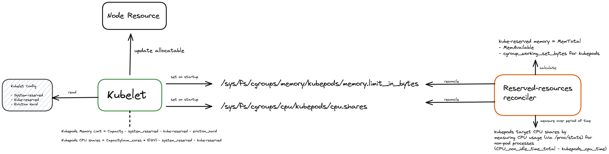

# Component

# Why do we need reconciled accurate resource reservations

**Why introduce such a mechanism now? We already run with static reserved resources since forever.**
- We removed CPU and memory limits in multiple places 
- bin-packing using custom kube-scheduler policy will be rolled out

**Benefits of accurate & reconciled resource reservations**
1) **Landscape Stability / Less ops effort**
  - Stakeholders expect Gardener nodes to be "unbreakable" / should never go affected by any Stakeholder workload
     - we need to protect the container runtime + kubelet (CPU starvation)
     - we need to prevent global OOMs that can cause OS deadlocks
  - Stakeholders cannot rely on kubelet eviction unless they have accurate memory reservations
2) SAFELY increase CPU & memory utilisation (wasting millions of $$$...) 
  - we already have good monitoring solutions to identify which containers waste CPU time (Istvan's Dashboard)
  
**Why not use the Shoot's/Seed's configuration for kube/system-reserved?**
- Reservations only on worker-pool level, but should be on node-level. Required reservation is different based on how many pods and what kind of pods are deployed.
- Adjusting the reserved resources requires a kubelet restart (unacceptable)

**Why not just over reserving resources by manually reserving the maximum required reservation of any node in the worker pool (use Shoot yaml)?**
- Requires monitoring + alerting + manual intervention to keep reserved resources up to date
  - Not feasible for Shoot clusters where the bulk of the ops effort comes from 
- Manually adjusting the kubelet reserved resources causes a kubelet restart (undesired)

**Why does K8s not support this already, e.g GKE could also benefit from such mechanism?**
- GKE hosts the controlplane in Borg cells which has highly sophisticated resource utilisation techniques(read chapter `5.Utilisation` of the [Borg paper](https://storage.googleapis.com/pub-tools-public-publication-data/pdf/43438.pdf)). 
- Cluster nodes are paid for by the customer, hence utilisation does not matter. 

**Why not calculate the resource reservations based on the machine type?**
- Poor man's solution
- See below points why this cannot work reliably

**Why is there such as discrepancy of the system's resource requirements (any non-pod process, container runtime, kubelet) between nodes?**
- The workload substantially influences the required resource reservations.
- Memory: 
  - Amount of pods deployed - larger state-of-the world cache for kubelet, more state to handle for the container runtime, more containerd-shims
- CPU: 
  - intensive container logging causes container runtime CPU consumption. Flow: `container-pipes -> containerd-shim -> FIFO for container -> read by containerd CRI process -> decorated and stored in /var/log/pods`
  - more pods -> more CRI requests (PLEG, stats, ...) -> more CPU consumption
  - Higher CPU time required during activity peaks (creating 200 pod replicas, eviction manager, kubelet stats, ...)

# Gardener Integration

**Options**
- contribute kubelet enhancement
- systemd service using cloud config execution script
  - no standard mechanism to expose metrics
  - either requires running a bash script (not so good for maintenance) or use systemd as container supervisor (that's what k8s is for)
- Daemonset

**Preferred**: Gardener-only solution for now