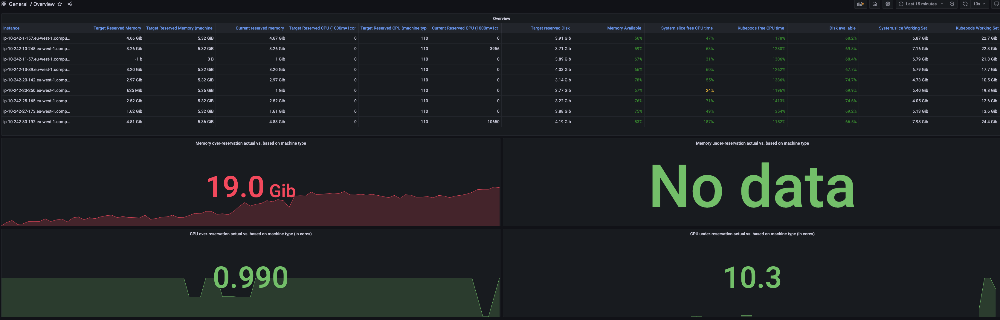

# Comparison of machine type-based reservations vs. reconciled reservations

Landscape issue for stakeholders are few, but create only sporadic issues at the moment.
- unknown if Stakeholders want to increase utilisation or rely on kubelet eviction more in the future (guessing)

**Main issue**: do we even want to increase utilisation in general (for us or stakeholders)?
- if we want to, then we need to have a safe mechanism to do so.
- We already see today under utilisations 
- We could pick on busy seed to simulate higher utilisation 
  - significant investment 
  - build istvan's memory dashboard to identify which pods need to be tuned
  - Possibly another VPA policy to recommend based on max peaks (gardener controllers + external controllers have peaks during startup - CPU: many goroutines)
  - Alternatively: try to node-local create higher utilisation
     - Ideas: Fake a higher capacity to trick the scheduler into scheduling more pods (simplest way)
       - Try to go to 250 max pods (are our seed node subnets large enough?) 
     - Prerequisite: bin-packing scheduler

## Canary

Done on aws-eu1 && aws-eu2

## Dev
dev-seed-aws

--> problem: requests is mostly < 100 %, hence overreservation is not so useful. Try canary.

# Analysis

**Caveat**: Comparison is looking also at nodes with < 100% requests, where over reservation of resources is not relevant.
With the introduction of the bin-packing scheduling policy, this will be a rare case though. Hence, this
simplified approach seems reasonable.

**Problems with only looking at under vs. over-reservation**

Comparing the current reservation recommendations is problematic as it can only provide a temporary view.
- When we increase the utilisation, this comparison will change (more uder or over-reservation)
- Changing workload causes a need for different resource reservations
- Not flexible enough: Stakeholder workload might be completely different requiring different reservations

**A static reservation can reliably protect against global OOMs and CPU starvation, only during best-case/lucky over reserving - but then SAP is wasting $**

A static CPU reservation does not capture spiking CPU resource needs under CPU contention: ideally you should give the system processes all 
the CPU time they need (do NOT complete with kubepods!)
- **When**: CPU contention and the kublet have a spike of CPU usage - eviction manager, create more pods, delete pods, ...
- **Why**: system processes (kubelet, container runtime) are critical and should be prioritized over workload.

**Verdict**: With a static resource reservation, SAP
- **Wastes memory and CPU resources** on nodes with 100% requests but workload that creates only little `system.slice` resource usage  
- does not avoid, but can possibly reduce, Ops effort (hard to quantify) 
- **Gardener cannot safely increase utilisation** (risk of global OOM or CPU starvation) -> millions of $ burned
  - Different workload causes more/less CPU & memory requirements for system slice.
    Resource demands when increasing utilisation (more pods with more accurate resource requests) will increase the prospected memory and CPU
    usage of `system.slice` --> increasing risk of under-reservation.
    - only mitigation: over reserve a lot
    - Manually make sure that reservation stays accurate. Problem if not: kubelet restart required for config change.

**Additionally**: Factoring-in the current utilisation of our Seed nodes (30-50%), we should rather have no
kube-reservations at all. Any reservation reduces allocatable, which reduces the number of pods scheduled to the node -> utilisation drops even more.
