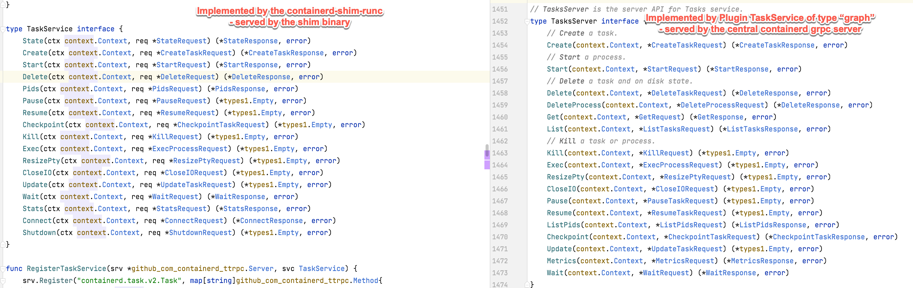
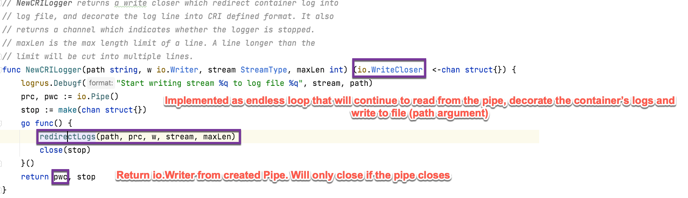
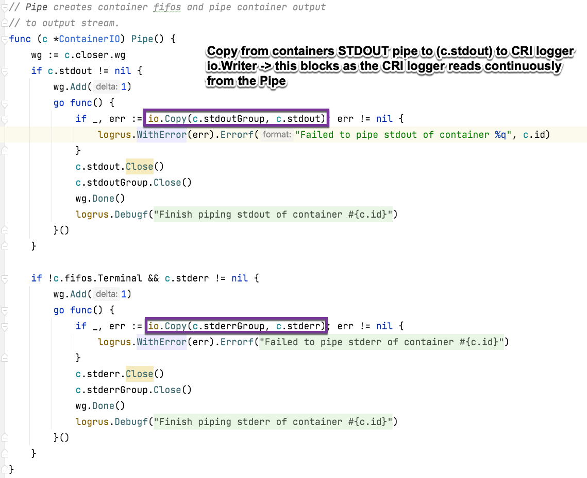
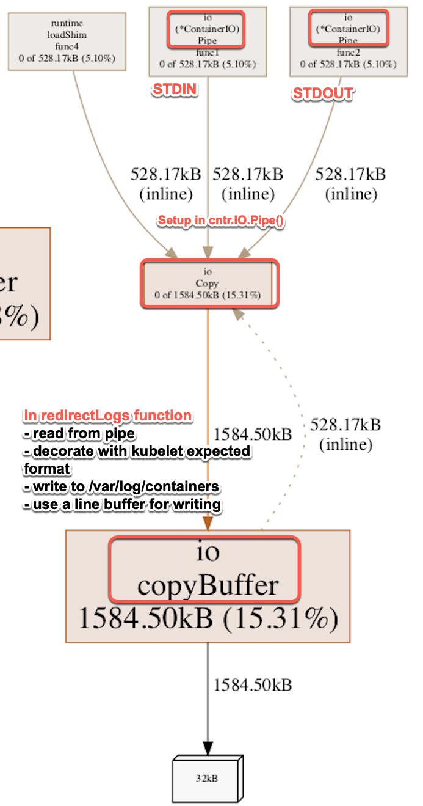

# Create Task flow `containerd` rough overview

Plugin register itself with `containerd` via `init()` functions. 
Important plugin types:

```
	RuntimePluginV2 Type = "io.containerd.runtime.v2"
	// ServicePlugin implements a internal service
	ServicePlugin Type = "io.containerd.service.v1"
	// GRPCPlugin implements a grpc service
	GRPCPlugin Type = "io.containerd.grpc.v1"
```

To get a quick understanding of the two main GRPC services involved



## The `TaskService` of type `grpc` plugin 
- registers itself [here](https://github.com/containerd/containerd/blob/bbe14f0a2eaca2bc2c84dfe4cd395fc184ca3830/services/tasks/service.go#L35-L34).
- grpc plugin so it serves the GRPC API for e.g `ctr` to use to run `tasks` (container processes)
- used by CRI?

Registers the [GRPC Service `TaskServer`](https://github.com/containerd/containerd/blob/8e448bb2798b94c09cf84e9b8de401d04f20decf/api/services/tasks/v1/tasks.pb.go#L1452-L1451) with the containerd deamon

```
// TasksServer is the server API for Tasks service.
type TasksServer interface {
	// Create a task.
	Create(context.Context, *CreateTaskRequest) (*CreateTaskResponse, error)
	// Start a process.
	Start(context.Context, *StartRequest) (*StartResponse, error)
	// Delete a task and on disk state.
	Delete(context.Context, *DeleteTaskRequest) (*DeleteResponse, error)
	DeleteProcess(context.Context, *DeleteProcessRequest) (*DeleteResponse, error)
	Get(context.Context, *GetRequest) (*GetResponse, error)
	List(context.Context, *ListTasksRequest) (*ListTasksResponse, error)
	// Kill a task or process.
	Kill(context.Context, *KillRequest) (*types1.Empty, error)
	Exec(context.Context, *ExecProcessRequest) (*types1.Empty, error)
	ResizePty(context.Context, *ResizePtyRequest) (*types1.Empty, error)
	CloseIO(context.Context, *CloseIORequest) (*types1.Empty, error)
	Pause(context.Context, *PauseTaskRequest) (*types1.Empty, error)
	Resume(context.Context, *ResumeTaskRequest) (*types1.Empty, error)
	ListPids(context.Context, *ListPidsRequest) (*ListPidsResponse, error)
	Checkpoint(context.Context, *CheckpointTaskRequest) (*CheckpointTaskResponse, error)
	Update(context.Context, *UpdateTaskRequest) (*types1.Empty, error)
	Metrics(context.Context, *MetricsRequest) (*MetricsResponse, error)
	Wait(context.Context, *WaitRequest) (*WaitResponse, error)
}
```
Registration happens [here](https://github.com/containerd/containerd/blob/bbe14f0a2eaca2bc2c84dfe4cd395fc184ca3830/services/tasks/service.go#L64)
```
func (s *service) Register(server *grpc.Server) error {
	api.RegisterTasksServer(server, s)
	return nil
}
```

Clients then can call the containerd grpc API (served via UDS).
Consequently, then receives `CreateTaskRequest`  `grpc` request.

```
type CreateTaskRequest struct {
	ContainerID string `protobuf:"bytes,1,opt,name=container_id,json=containerId,proto3" json:"container_id,omitempty"`
	// RootFS provides the pre-chroot mounts to perform in the shim before
	// executing the container task.
	//
	// These are for mounts that cannot be performed in the user namespace.
	// Typically, these mounts should be resolved from snapshots specified on
	// the container object.
	Rootfs               []*types.Mount    `protobuf:"bytes,3,rep,name=rootfs,proto3" json:"rootfs,omitempty"`
	Stdin                string            `protobuf:"bytes,4,opt,name=stdin,proto3" json:"stdin,omitempty"`
	Stdout               string            `protobuf:"bytes,5,opt,name=stdout,proto3" json:"stdout,omitempty"`
	Stderr               string            `protobuf:"bytes,6,opt,name=stderr,proto3" json:"stderr,omitempty"`
	Terminal             bool              `protobuf:"varint,7,opt,name=terminal,proto3" json:"terminal,omitempty"`
	Checkpoint           *types.Descriptor `protobuf:"bytes,8,opt,name=checkpoint,proto3" json:"checkpoint,omitempty"`
	Options              *types1.Any       `protobuf:"bytes,9,opt,name=options,proto3" json:"options,omitempty"`
	XXX_NoUnkeyedLiteral struct{}          `json:"-"`
	XXX_unrecognized     []byte            `json:"-"`
	XXX_sizecache        int32             `json:"-"`
}
```
After, uses the registered `service plugin` of type `task-service` to go forward.
Just hands over the received GRPC `api.CreateTaskRequest` to the `TaskService` of type `service`.

```
func (s *service) Create(ctx context.Context, r *api.CreateTaskRequest) (*api.CreateTaskResponse, error) {
	return s.local.Create(ctx, r)
}
```

## The `TaskService` of type `service` 
- plugin is registered [here](https://github.com/containerd/containerd/blob/4422ae363828c035f76a7b2c45e3419f77d164f9/services/tasks/local.go#L69) (same directory in source code)
- requires the runtime service `io.containerd.runtime.v2`
- does not host the GRPC service itself, but gets the grpc requests handed over by the `TaskService` of type `grpc` plugin

```
var tasksServiceRequires = []plugin.Type{
	plugin.RuntimePlugin,
	plugin.RuntimePluginV2,
	plugin.MetadataPlugin,
	plugin.TaskMonitorPlugin,
}
```


In the [`func (l *local) Create(ctx context.Context, r *api.CreateTaskRequest, _ ...grpc.CallOption) (*api.CreateTaskResponse, error) `](https://github.com/containerd/containerd/blob/4422ae363828c035f76a7b2c45e3419f77d164f9/services/tasks/local.go#L141-L140) the options for tasks creation are build.

Get the OCI container specification using the `containers.Store` (also a plugin storing the OCI config in local `bolt.db`).
```
container, err := l.getContainer(ctx, r.ContainerID)
	if err != nil {
		return nil, errdefs.ToGRPC(err)
	}
```

Options to call the runtime plugin (just a function call as `containerd` internal, not grpc)
- See that it has the container OCI spec from the container service `bolt.db`
- The file descriptors for the containers I/O FIFOS
- The name of the `containerd-runtime-shim` binary

```
	opts := runtime.CreateOpts{
		Spec: container.Spec,
		IO: runtime.IO{
			Stdin:    r.Stdin,
			Stdout:   r.Stdout,
			Stderr:   r.Stderr,
			Terminal: r.Terminal,
		},
		Checkpoint:     checkpointPath,
		Runtime:        container.Runtime.Name,
		RuntimeOptions: container.Runtime.Options,
		TaskOptions:    r.Options,
	}
	for _, m := range r.Rootfs {
		opts.Rootfs = append(opts.Rootfs, mount.Mount{
			Type:    m.Type,
			Source:  m.Source,
			Options: m.Options,
		})
	}
```

Calls the `Create(ctx context.Context, id string, opts CreateOpts) (Task, error)` function of the `PlatformRuntime` interface of the `io.containerd.runtime.v2` plugin [here](https://github.com/containerd/containerd/blob/4422ae363828c035f76a7b2c45e3419f77d164f9/services/tasks/local.go#L210)


## The  plugin `io.containerd.runtime.v2`
 - Registration happens automatically [here](https://github.com/containerd/containerd/blob/d82fa431937f0fda2c11f45fd52da48ab899c29c/runtime/v2/manager.go#L46).

In `init()` creates
- containerd `root` (`var/lib//containerd`) directory on the filesystem
- containerd `state` (`/run/containerd`) directory on the filesystem
- `container` store (contains all the OCI runtime specs of the containers to create)

The `manager` implements the interface `PlatformRuntime`
 - this is how the `TaskService` of type `service` can invoke the `io.containerd.runtime.v2` plugin's  `Create()` method to let it run the `containerd-shim` binary which runs the container process via the OCI runtime.

```
type PlatformRuntime interface {
	// ID of the runtime
	ID() string
	// Create creates a task with the provided id and options.
	Create(ctx context.Context, id string, opts CreateOpts) (Task, error)
	// Get returns a task.
	Get(context.Context, string) (Task, error)
	// Tasks returns all the current tasks for the runtime.
	// Any container runs at most one task at a time.
	Tasks(context.Context, bool) ([]Task, error)
	// Add adds a task into runtime.
	Add(context.Context, Task) error
	// Delete remove a task.
	Delete(context.Context, string)
}
```

Internally, the `manager` executes the `containerd-shim` binary as separate process [here](https://github.com/containerd/containerd/blob/d82fa431937f0fda2c11f45fd52da48ab899c29c/runtime/v2/manager.go#L120-L119).
- executes the shim binary with flags
- creates the `log` FIFO for the containerd-shims own debug logs -> also starts goroutine to continuously copy from the `log` FIFO to containerd daemons own STDOUT

```
b := shimBinary(ctx, bundle, opts.Runtime, m.containerdAddress, m.containerdTTRPCAddress, m.events, m.tasks)
shim, err := b.Start(ctx, topts, func() {..})
```

The manager, after having run the `containerd-shim` binary, uses the GRPC service `taskService` hosted by the `containerd-shim` to create the container process / task.
 - done [here](https://github.com/containerd/containerd/blob/dc92ad65206d9c43ba87f483a794bc6566e83e91/runtime/v2/shim.go#L279)
```
response, err := s.task.Create(ctx, request)
```

## The `containerd-shim` binary
- source code is also in the containerd repository, but is actually executed as a separate binary + process.
- example shim implementing the GRPC `taskService` can be found [here](https://github.com/containerd/containerd/blob/2dacef07ca352b814872b5aa21aba01f0ece4d43/runtime/v2/example/README.md).
- `Runc` containerd-shim is implemented [here](https://github.com/containerd/containerd/blob/d7b9cb00198600574ea8ac6db62ea8bdd076e466/runtime/v2/runc/v2/service.go).

Implements the GRPC `TaskService` [found here](https://github.com/containerd/containerd/blob/8e448bb2798b94c09cf84e9b8de401d04f20decf/runtime/v2/task/shim.pb.go#L3384).

```
type TaskService interface {
	State(ctx context.Context, req *StateRequest) (*StateResponse, error)
	Create(ctx context.Context, req *CreateTaskRequest) (*CreateTaskResponse, error)
	Start(ctx context.Context, req *StartRequest) (*StartResponse, error)
	Delete(ctx context.Context, req *DeleteRequest) (*DeleteResponse, error)
	Pids(ctx context.Context, req *PidsRequest) (*PidsResponse, error)
	Pause(ctx context.Context, req *PauseRequest) (*types1.Empty, error)
	Resume(ctx context.Context, req *ResumeRequest) (*types1.Empty, error)
	Checkpoint(ctx context.Context, req *CheckpointTaskRequest) (*types1.Empty, error)
	Kill(ctx context.Context, req *KillRequest) (*types1.Empty, error)
	Exec(ctx context.Context, req *ExecProcessRequest) (*types1.Empty, error)
	ResizePty(ctx context.Context, req *ResizePtyRequest) (*types1.Empty, error)
	CloseIO(ctx context.Context, req *CloseIORequest) (*types1.Empty, error)
	Update(ctx context.Context, req *UpdateTaskRequest) (*types1.Empty, error)
	Wait(ctx context.Context, req *WaitRequest) (*WaitResponse, error)
	Stats(ctx context.Context, req *StatsRequest) (*StatsResponse, error)
	Connect(ctx context.Context, req *ConnectRequest) (*ConnectResponse, error)
	Shutdown(ctx context.Context, req *ShutdownRequest) (*types1.Empty, error)
}
```

Sets up the container using `runc` internally (if it is the `runc` shim).

## The Containerd CRI
- part of the containerd source code [under /pkg/cri](https://github.com/containerd/containerd/blob/0a0621bb47d48d8cbcbb614ee38422ce8b98a340/pkg/cri/cri.go)
- a regular containerd grpc plugin!

Registers itself
 - Note: does not use the runtime plugin directly, but uses the `TaskService` of type `service` (which internally calls the runtime plugin).

```
plugin.Register(&plugin.Registration{
    Type:   plugin.GRPCPlugin,
    ID:     "cri",
    Config: &config,
    Requires: []plugin.Type{
        plugin.EventPlugin,
        plugin.ServicePlugin,
    },
    InitFn: initCRIService,
})
```

Also registers the CRI grpc API with the containerd central grpc server
 - implements and serves `CRI` GRPC Service found [here](https://github.com/containerd/containerd/blob/e634f04d8cdb6c2f96eea2e4e66d0e4500a46282/vendor/k8s.io/cri-api/pkg/apis/runtime/v1/api.pb.go#L7871)
```
func (c *criService) register(s *grpc.Server) error {
	instrumented := newInstrumentedService(c)
	runtime.RegisterRuntimeServiceServer(s, instrumented)
	runtime.RegisterImageServiceServer(s, instrumented)
	instrumentedAlpha := newInstrumentedAlphaService(c)
	runtime_alpha.RegisterRuntimeServiceServer(s, instrumentedAlpha)
	runtime_alpha.RegisterImageServiceServer(s, instrumentedAlpha)
	return nil
}
```

The CRI plugin configuration can be found [here](https://github.com/containerd/containerd/blob/1efed43090fcb24eb138acf318b9edef91d22007/pkg/cri/config/config.go)

```
// PluginConfig contains toml config related to CRI plugin,
// it is a subset of Config.
type PluginConfig struct {
	// ContainerdConfig contains config related to containerd
	ContainerdConfig `toml:"containerd" json:"containerd"`
	// CniConfig contains config related to cni
	CniConfig `toml:"cni" json:"cni"`
	// Registry contains config related to the registry
	Registry Registry `toml:"registry" json:"registry"`
	// ImageDecryption contains config related to handling decryption of encrypted container images
	ImageDecryption `toml:"image_decryption" json:"imageDecryption"`
	// DisableTCPService disables serving CRI on the TCP server.
	DisableTCPService bool `toml:"disable_tcp_service" json:"disableTCPService"`
	// StreamServerAddress is the ip address streaming server is listening on.
	StreamServerAddress string `toml:"stream_server_address" json:"streamServerAddress"`
	// StreamServerPort is the port streaming server is listening on.
	StreamServerPort string `toml:"stream_server_port" json:"streamServerPort"`
 ......
 } 
```

In `init()` 
- creates containerd client (not using grpc)
```
	client, err := containerd.New(
		"",
		containerd.WithDefaultNamespace(constants.K8sContainerdNamespace),
		containerd.WithDefaultPlatform(platforms.Default()),
		containerd.WithServices(servicesOpts...),
    )
```
- also loads the base `OCI Runtime-Spec` used for all containers of pods
- initalizes the CRI service [here](https://github.com/containerd/containerd/blob/8d135d28420a1f8aa7ce8bb2f56103555f380a5f/pkg/cri/server/service.go#L116)

In [`Run()` the CRI](https://github.com/containerd/containerd/blob/8d135d28420a1f8aa7ce8bb2f56103555f380a5f/pkg/cri/server/service.go#L181) is brought to life
- Start snapshot stats syncer
- Start CNI config sync loop
- start streaming server for `exec` and `log` streaming requests
- sets the CRI to ready so the central grpc server in containerd daemon starts serving the CRI API

### Serving the CRI API

CRI GRPC service found [here](https://github.com/containerd/containerd/blob/e634f04d8cdb6c2f96eea2e4e66d0e4500a46282/vendor/k8s.io/cri-api/pkg/apis/runtime/v1/api.pb.go#L7871).

```
// RuntimeServiceServer is the server API for RuntimeService service.
type RuntimeServiceServer interface {
	// Version returns the runtime name, runtime version, and runtime API version.
	Version(context.Context, *VersionRequest) (*VersionResponse, error)
	// RunPodSandbox creates and starts a pod-level sandbox. Runtimes must ensure
	// the sandbox is in the ready state on success.
	RunPodSandbox(context.Context, *RunPodSandboxRequest) (*RunPodSandboxResponse, error)
	// StopPodSandbox stops any running process that is part of the sandbox and
	// reclaims network resources (e.g., IP addresses) allocated to the sandbox.
	// If there are any running containers in the sandbox, they must be forcibly
	// terminated.
	// This call is idempotent, and must not return an error if all relevant
	// resources have already been reclaimed. kubelet will call StopPodSandbox
	// at least once before calling RemovePodSandbox. It will also attempt to
	// reclaim resources eagerly, as soon as a sandbox is not needed. Hence,
	// multiple StopPodSandbox calls are expected.
	StopPodSandbox(context.Context, *StopPodSandboxRequest) (*StopPodSandboxResponse, error)
	// RemovePodSandbox removes the sandbox. If there are any running containers
	// in the sandbox, they must be forcibly terminated and removed.
	// This call is idempotent, and must not return an error if the sandbox has
	// already been removed.
	RemovePodSandbox(context.Context, *RemovePodSandboxRequest) (*RemovePodSandboxResponse, error)
	// PodSandboxStatus returns the status of the PodSandbox. If the PodSandbox is not
	// present, returns an error.
	PodSandboxStatus(context.Context, *PodSandboxStatusRequest) (*PodSandboxStatusResponse, error)
	// ListPodSandbox returns a list of PodSandboxes.
	ListPodSandbox(context.Context, *ListPodSandboxRequest) (*ListPodSandboxResponse, error)
	// CreateContainer creates a new container in specified PodSandbox
	CreateContainer(context.Context, *CreateContainerRequest) (*CreateContainerResponse, error)
	// StartContainer starts the container.
	StartContainer(context.Context, *StartContainerRequest) (*StartContainerResponse, error)
	// StopContainer stops a running container with a grace period (i.e., timeout).
	// This call is idempotent, and must not return an error if the container has
	// already been stopped.
	// The runtime must forcibly kill the container after the grace period is
	// reached.
	StopContainer(context.Context, *StopContainerRequest) (*StopContainerResponse, error)
	// RemoveContainer removes the container. If the container is running, the
	// container must be forcibly removed.
	// This call is idempotent, and must not return an error if the container has
	// already been removed.
	RemoveContainer(context.Context, *RemoveContainerRequest) (*RemoveContainerResponse, error)
	// ListContainers lists all containers by filters.
	ListContainers(context.Context, *ListContainersRequest) (*ListContainersResponse, error)
	// ContainerStatus returns status of the container. If the container is not
	// present, returns an error.
	ContainerStatus(context.Context, *ContainerStatusRequest) (*ContainerStatusResponse, error)
	// UpdateContainerResources updates ContainerConfig of the container.
	UpdateContainerResources(context.Context, *UpdateContainerResourcesRequest) (*UpdateContainerResourcesResponse, error)
	// ReopenContainerLog asks runtime to reopen the stdout/stderr log file
	// for the container. This is often called after the log file has been
	// rotated. If the container is not running, container runtime can choose
	// to either create a new log file and return nil, or return an error.
	// Once it returns error, new container log file MUST NOT be created.
	ReopenContainerLog(context.Context, *ReopenContainerLogRequest) (*ReopenContainerLogResponse, error)
	// ExecSync runs a command in a container synchronously.
	ExecSync(context.Context, *ExecSyncRequest) (*ExecSyncResponse, error)
	// Exec prepares a streaming endpoint to execute a command in the container.
	Exec(context.Context, *ExecRequest) (*ExecResponse, error)
	// Attach prepares a streaming endpoint to attach to a running container.
	Attach(context.Context, *AttachRequest) (*AttachResponse, error)
	// PortForward prepares a streaming endpoint to forward ports from a PodSandbox.
	PortForward(context.Context, *PortForwardRequest) (*PortForwardResponse, error)
	// ContainerStats returns stats of the container. If the container does not
	// exist, the call returns an error.
	ContainerStats(context.Context, *ContainerStatsRequest) (*ContainerStatsResponse, error)
	// ListContainerStats returns stats of all running containers.
	ListContainerStats(context.Context, *ListContainerStatsRequest) (*ListContainerStatsResponse, error)
	// UpdateRuntimeConfig updates the runtime configuration based on the given request.
	UpdateRuntimeConfig(context.Context, *UpdateRuntimeConfigRequest) (*UpdateRuntimeConfigResponse, error)
	// Status returns the status of the runtime.
	Status(context.Context, *StatusRequest) (*StatusResponse, error)
}
```

**Flow**:
**1) RunPodSandbox()**
   - Containerd implemented [here](https://github.com/containerd/containerd/blob/f40df3d72ba85700c737aca2cb21212d8f0caaed/pkg/cri/server/sandbox_run.go#L59)
   - Create pod network via CNI
   - create `OCI RuntimeSpec` and set on internal container struct
   - Create `container` (not a running process) with the containerd-internal containerd service -> ends up as config data in `bold.db`
   - Set up the root directory of the container
   - Setup files
     - For Linux: copy host's `resolve.conf` to the root of where the container image will be extracted
     - hostname file in `etc/hostname`
     - container scratch space via `dev/shm` device (is a `tmpfs`): see [here for more info](https://www.cyberciti.biz/tips/what-is-devshm-and-its-practical-usage.html).
   - Creates a task with containerd
   - Starts the sandbox tasks to bring the Pod sandbox to life
     - This uses containerd's Task Service of type `service` to run the `containerd-shim` which instructs `runc` to setup the Linux namespaces + control groups + runs the init process of the default `pause image`.
     - See what is created as a result in containerd and on the filesystem via crictl here in mt Joplin notes: [Crictl](:/ee80a375a9ce41019d74610c7682fa4d)


**2) CreateContainer()**
- only creates metadata via container service in containerd
- See: [Crictl](:/ee80a375a9ce41019d74610c7682fa4d)


**3) StartContainer()**
- Overall: Start the pod's container joining the namespaces of the PodSandbox.
- Implemented [here in containerd](https://github.com/containerd/containerd/blob/a5c417ac060f29dad343573674f879d59fc0b9ef/pkg/cri/server/container_start.go#L42)
- See: [Crictl](:/ee80a375a9ce41019d74610c7682fa4d)

Get container metadata
```
cntr, err := c.containerStore.Get(r.GetContainerId())
```

Get sandbox ID for the container


```
// Get sandbox config from sandbox store.
sandbox, err := c.sandboxStore.Get(meta.SandboxID)

// sandbox needs to be ready (pause container process running and namespaces & files setup)
if sandbox.Status.Get().State != sandboxstore.StateReady {
		return nil, errors.Errorf("sandbox container %q is not running", sandboxID)
}
```

Create I/O  for the container
- `FIFOs` OR `TTYs`

```
ioCreation := func(id string) (_ containerdio.IO, err error) {
		stdoutWC, stderrWC, err := c.createContainerLoggers(meta.LogPath, config.GetTty())
		if err != nil {
			return nil, errors.Wrap(err, "failed to create container loggers")
		}
		cntr.IO.AddOutput("log", stdoutWC, stderrWC)
		cntr.IO.Pipe()
		return cntr.IO, nil
	}
```

Create new task metadata with containerd

```
task, err := container.NewTask(ctx, ioCreation, taskOpts...)
```

Start the containerd tasks
 - this invokes containerd's TaskService of type `service`  ->  internal uses the Service `io.containerd.runtime.v2` to create the shim binary for the container process -> runc to setup namespaces to join sandbox + run container process

```
// Start containerd task.
	if err := task.Start(ctx); err != nil {
		return nil, errors.Wrapf(err, "failed to start containerd task %q", id)
	}

```

This invokes `Start()` of the Task interface
 - internal code that can be used to interact with containerd services without having to go over `grpc` (like an external client like `ctr`)
 - See [the Task interface here](https://github.com/containerd/containerd/blob/55faa5e93d7fdacc7d9b28ee79a0972ec18e3471/task.go#L151-L150)
 - See the `Start()` method which is in `Process` but embedded in the `Task` [here](https://github.com/containerd/containerd/blob/16f3d67b5a804b3a32a5df6318531768a654ef8c/process.go#L38)

Just uses the containerd  `TaskService` of type `service` to relay the start
 - the container metadata has already been created before using `container.NewTask()`

```
func (t *task) Start(ctx context.Context) error {
	r, err := t.client.TaskService().Start(ctx, &tasks.StartRequest{
		ContainerID: t.id,
	})
	if err != nil {
		if t.io != nil {
			t.io.Cancel()
			t.io.Close()
		}
		return errdefs.FromGRPC(err)
	}
	t.pid = r.Pid
	return nil
}
```


## I/O for container processes

The documentation for the [containerd-shim](https://github.com/containerd/containerd/blob/6e638ad27a6b5708f8b0eb06b17d3d0352609a2f/runtime/v2/README.md#io) states explicitly:

```
I/O for a container is provided by the client to the containerd-shim via fifo on Linux, named pipes on Windows, or log files on disk.
The paths to these files are provided on the `Create` rpc for the initial creation and on the `Exec` rpc for additional processes.
```
- that means that the **containerd-shim does NOT create the STDIO FIFOS for the container process itself**.
- instead the client (such as CRI) has created the FIFOS before and is reading from them.


**Who creates the FIFOs for the container processes in case of Kubernetes?**

CRI-shim create I/O  for the container in the `StartContainer()` function
- `FIFOs` OR `TTYs`

The CRI creates the FIFOS first, and creates the container metadata with it
```
task, err := container.NewTask(ctx, ioCreation, taskOpts...)
```
Then calls the `TaskService` of type `service` as seen above to start the container.

### How does the log flow from container STDOUT -> /var/log/containers 
 - Background information: [KEP on kubelet + CRI logging interaction](https://github.com/kubernetes/community/blob/master/contributors/design-proposals/node/kubelet-cri-logging.md) 
    - Where the container runtime has to write the container's logs to
    - Format of logs to support `kubectl logs`

The containers IO related info is held in the struct `ContainerIO` [here](https://github.com/containerd/containerd/blob/1f5b84f27cd675780bc7127f9aedbfe34cc7590b/pkg/cri/io/container_io.go#L38-L37)

```
// ContainerIO holds the container io.
type ContainerIO struct {
	id string

	fifos *cio.FIFOSet
	*stdioPipes

	stdoutGroup *cioutil.WriterGroup
	stderrGroup *cioutil.WriterGroup

	closer *wgCloser
}
```

Creates all I/O for the container [here](https://github.com/containerd/containerd/blob/a5c417ac060f29dad343573674f879d59fc0b9ef/pkg/cri/server/container_start.go#L98)
```
ioCreation := func(id string) (_ containerdio.IO, err error) {
        # setup the CRI logger & create log file of container
        # creates the Pipe or TTY 
        # starts goroutine reads continously from Pipe to decorate & write to log file
		stdoutWC, stderrWC, err := c.createContainerLoggers(meta.LogPath, config.GetTty())
		if err != nil {
			return nil, errors.Wrap(err, "failed to create container loggers")
		}
		
		# set CRI logger as STDOUT and STERR of continer metadata
		cntr.IO.AddOutput("log", stdoutWC, stderrWC)
		
		# starts copying from the container pipes to the io.writer implemented by the logger (writes to log file)
		# starts goroutine that blocks until the pipe is closes
		cntr.IO.Pipe()
		return cntr.IO, nil
	}
```

Creates the `log file` under `var/log/containers/...` for the container [here](https://github.com/containerd/containerd/blob/1224060f8928ef58c8d480bc7763a09b19427413/pkg/cri/server/helpers_linux.go#L156-L155)

```
f, err := openLogFile(logPath)
```


Then creates a new CRI logger here (handing over the `log file` path as destination sink)


Internally, the CRI logger directly reads from the FIFOS or TTYs (master side) of the container process.
Decoration and actually writing of the logs happens directly [here](https://github.com/containerd/containerd/blob/a5c417ac060f29dad343573674f879d59fc0b9ef/pkg/cri/io/logger.go#L115)  in `redirectLogs`.


In `redirectLogs` continously reads from Pipe reader

```
for {
		var stop bool
		newLine, isPrefix, err := readLine(r) #blocks until new lines
		...
		write (as seen below)
	} 
```
Actually uses a buffered writer and decorates STDOUT to match kubelet expected log format as described in KEP.

```
		timeBuffer = time.Now().AppendFormat(timeBuffer[:0], timestampFormat)
		headers := [][]byte{timeBuffer, stream, tag}

		lineBuffer.Reset()
		for _, h := range headers {
			lineBuffer.Write(h)
			lineBuffer.Write(delimiter)
		}
		for _, l := range lineBytes {
			lineBuffer.Write(l)
		}
		lineBuffer.WriteByte(eol)
		if _, err := lineBuffer.WriteTo(w); err != nil {
			logrus.WithError(err).Errorf("Fail to write %q log to log file %q", s, path)
			// Continue on write error to drain the container output.
		}
```

Start continoous logging



Check the heap profile to see that big chunk of heap is used for forwarding logs via the `io.Copy()` which uses the `io.Writer()` internally which is implemented via the `redirectLogs`.
 - I suspect this to be much higher on productive nodes with a lot of logs!!
 - Might be a reason for much higher memory consumption of containerd




# TODO

Compare the heap profile of production Seed cluster Node with one from my local Dev cluster!!
- see if the mempry used for copying logs might be a contribution factor for high memory usage of containerd
