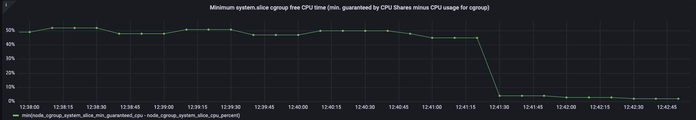
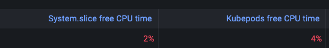
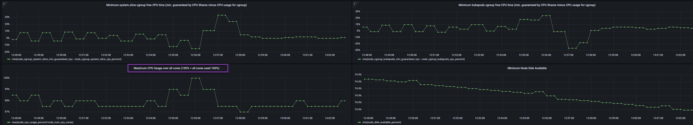
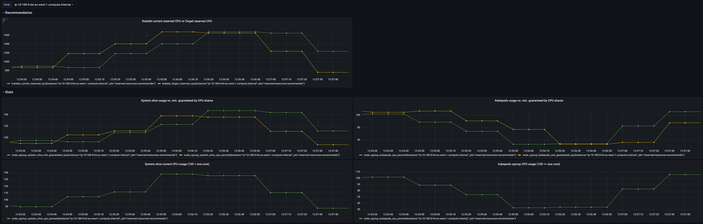
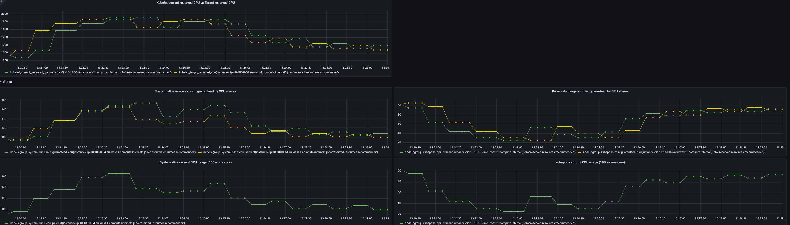

# Simulate CPU load in kubepods

Just use the chaos simulation with  `cpu_chaos.yaml` -> uses `nsenter`/ `nsexec` to start `stress-ng` in a pod container's Linux PID namespaces.

See this in action (no sidecar container used - no pod restart)

```
root       91732  0.0  0.0   3388  2464 ?        S    10:14   0:00      \_ /usr/local/bin/nsexec -p /proc/88935/ns/pid -- stress-ng --cpu-load-slice 10 --cpu-method sqrt --cpu 6 --cpu-load 50
root       91733  0.0  0.0  59236  5812 ?        SL   10:14   0:00          \_ stress-ng --cpu-load-slice 10 --cpu-method sqrt --cpu 6 --cpu-load 50
root       91734 21.7  0.0  59236   392 ?        R    10:14   5:15              \_ stress-ng --cpu-load-slice 10 --cpu-method sqrt --cpu 6 --cpu-load 50
root       91735 21.8  0.0  59236   392 ?        R    10:14   5:16              \_ stress-ng --cpu-load-slice 10 --cpu-method sqrt --cpu 6 --cpu-load 50
root       91736 21.9  0.0  59236   392 ?        R    10:14   5:17              \_ stress-ng --cpu-load-slice 10 --cpu-method sqrt --cpu 6 --cpu-load 50
root       91737 21.8  0.0  59236   392 ?        S    10:14   5:17              \_ stress-ng --cpu-load-slice 10 --cpu-method sqrt --cpu 6 --cpu-load 50
root       91738 21.7  0.0  59236   392 ?        S    10:14   5:14              \_ stress-ng --cpu-load-slice 10 --cpu-method sqrt --cpu 6 --cpu-load 50
root       91739 21.8  0.0  59236   392 ?        S    10:14   5:16              \_ stress-ng --cpu-load-slice 10 --cpu-method sqrt --cpu 6 --cpu-load 50
```


# Simulate CPU load in system.slice

Get a root shell to a node.

Use `stress-ng` to create a CPU load inducing process
- if your shell is via `ssh`, the process is created in user.slice 
- if you have a `kubelet exec` connection to a root pod, then the process is accociated with the cgroup of the rootpod

```
stress-ng --cpu-method sqrt --cpu 2 --cpu-load 50
```


Then, change the `stress-ng` process to belong to the system.slice cgroup (cgroupsV1).
First, get the PID and the TIDs of it's threads.
```
root@ip-10-180-0-64:/# ps auxf | grep stress
root      106799  0.0  0.1  73408  8360 pts/0    SL+  10:32   0:00                          \_ stress-ng --cpu-method sqrt --cpu 2 --cpu-load 50
root      106801 35.6  0.0  73408   716 pts/0    R+   10:32   0:03                              \_ stress-ng-cpu [run]
root      106802 34.7  0.0  73408   716 pts/0    S+   10:32   0:03                              \_ stress-ng-cpu [run]
```

See the current cgroupsV1 for this process
```
root@ip-10-180-0-64:/# cat /proc/106799/cgroup
12:devices:/user.slice
11:perf_event:/
10:rdma:/
9:hugetlb:/
8:blkio:/user.slice
7:freezer:/
6:memory:/user.slice/user-1001.slice/session-2.scope
5:pids:/user.slice/user-1001.slice/session-2.scope
4:cpuset:/
3:cpu,cpuacct:/user.slice
2:net_cls,net_prio:/
1:name=systemd:/user.slice/user-1001.slice/session-2.scope
0::/user.slice/user-1001.slice/session-2.scope
```

Change the cgroup for the process AND its threads

```
echo 106799 > /sys/fs/cgroup/cpu/system.slice/tasks
echo 106801  > /sys/fs/cgroup/cpu/system.slice/tasks
echo 106802  > /sys/fs/cgroup/cpu/system.slice/tasks
```

See the changed CPU cgroup

```
root@ip-10-180-0-64:/# cat /proc/106799/cgroup
12:devices:/user.slice
11:perf_event:/
10:rdma:/
9:hugetlb:/
8:blkio:/user.slice
7:freezer:/
6:memory:/user.slice/user-1001.slice/session-2.scope
5:pids:/user.slice/user-1001.slice/session-2.scope
4:cpuset:/
3:cpu,cpuacct:/system.slice
2:net_cls,net_prio:/
1:name=systemd:/user.slice/user-1001.slice/session-2.scope
```

Observe that the system.slice CPU consumption increases



# Simulation: Require kubelet + container runtime activity burst under during full CPU load

**Scenario**: 
- System.slice + kubepods already 99% of physically available CPU
- System.slice legitimately needs even more CPU time - here: delete 100 pods from the node




**Test execution**: Just cause kubelet + containerd CPU consumption by scaling a deployment up/down (here: by 100 replicas)



Another example scaling up 220 pods during CPU contention



**Observation**: 
- the reserved-resource-recommender temporarily reduced kubepods cpushares in order to give system.slice more CPU time during the kubelet's burst of activity.
- Because it is a resource contention scenario, kubepods was actually only able to use it's minally guaranteed CPUShares (which have been reduced below its actually required level)
- The workload in kubepods received temporarily less and the system.slice more CPU time
  - On this 2 core machine, kubepods temporarily received as low as 20% of one core as the kubelet + container runtime needed the rest of the CPU to create 220 pods
- After the activity burst, kubepods again got close to the same CPU time (minus what extra CPU consumption the pods cause for system.slice)

**Result**: The kubelet and the container runtime successfully completed its acticity burst even under a CPU contention situation
