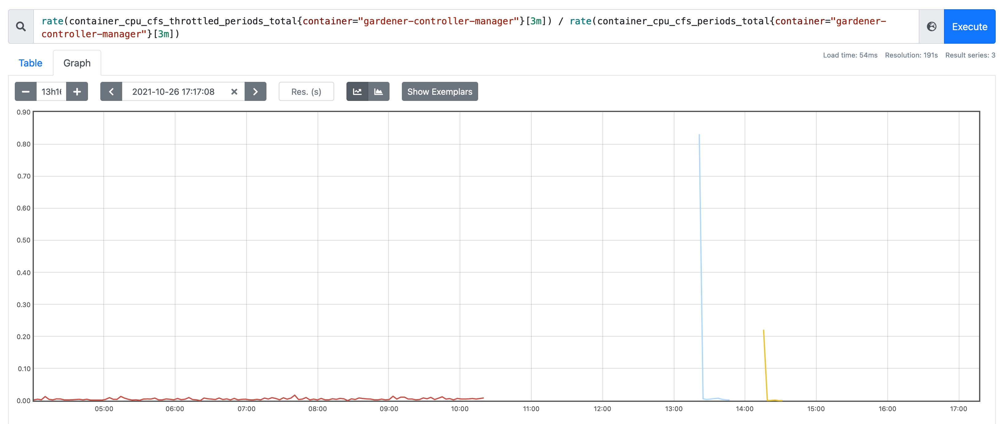
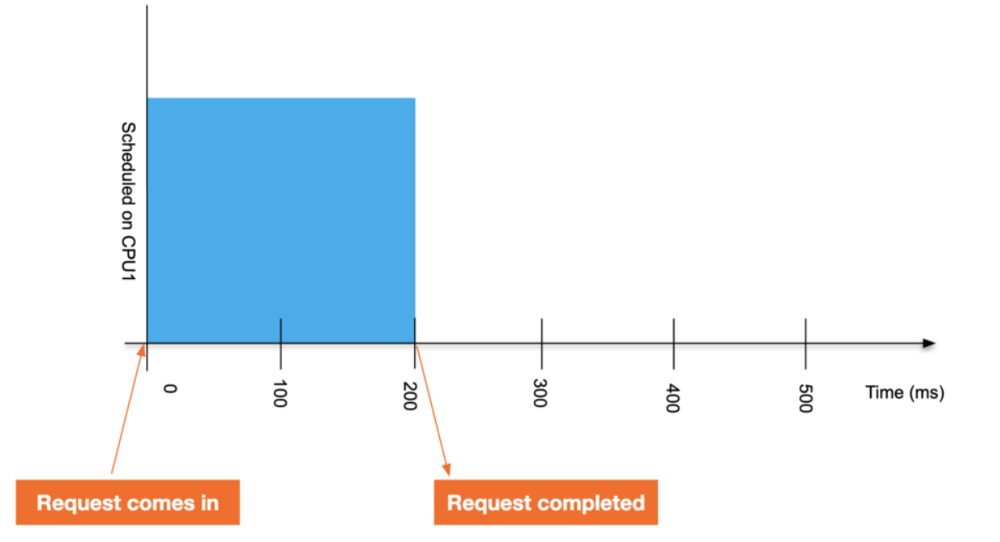
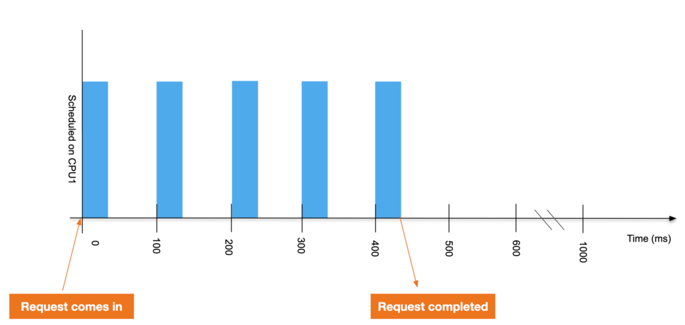

## Prometheus throttling for GCM
Only shows the percentage of periods where it got throttled during the 1s period.
Does not say anything about how long it got thottled.




## Run the throttling script

```bash
    script_location=/Users/d060239/go/src/github.com/danielfoehrkn/better-resource-reservations/hack/analyze-cgroup-cpu-throtlling.sh
    kubectl exec -it deployment/gardener-controller-manager -- sh -c "$(cat $script_location)"
```

Result:

```
Total execution time during 10 periods:  1.86928 (usage + throttled time)
rate(cpu_usage_seconds_total[1s]): 0.946829  (1 = one core during 1 second period)
rate(throttled_time_seconds[1s]): 0.922453 (throttled_time_stop(1338767233283) - throttled_time_start(1337844780079)
rate(throttled_periods[1s]) 2 had some throttling (total periods executing within 1s interval: 10)
rate(throttled_periods_percentage[1s]): 20% (100% = all periods (100 ms) within one second interval had some throttling. Does not mean threads could not execute)
since birth: percentage of throttled periods: 0.00310147 (nr_periods_throttled(2773) / nr_periods(894092)
throttle_quotient for 1s interval (throttled_time_seconds / cpu_usage_seconds_total):  0.974255
```

## Background 
- Source: https://engineering.indeedblog.com/blog/2019/12/unthrottled-fixing-cpu-limits-in-the-cloud/  (with pictures)


Example without limits: 
 - Interval 1 second
 - Each period is 100ms (cpu.cfs_period_us)
 - Process only needs to execute for 200 ms total => only 2 periods used (nr_periods) during 1s interval.



**Example with limit enabled:**
 - Interval 1 second
 - CPU limit of `.4` CPU to the application. (`cpu.cfs_quota_us` = 40ms - the application gets 40ms of run time for every 100ms period)
 - `nr_periods` = 5 (execute for 40 ms in 5 periods) - other 5 periods not executed (no demand from application)
 - `nr_throttled` = 4 (4 out of 5 periods it could only execute for 40 ms)
 - `throttled_time` = 240 ms (4 * 60 ms throttled)
 - `throttled percentage` = 80% (4 throttled periods / 5 total period executing)




**Gotcha**: A `throttled percentage` of 100 % means for 2s interval wit 4 cores limit (`cpu.cfs_quota_us` = 400ms)
 - `nr_periods` = 20, `nr_throttled` = 20 
 - On a 4 core machine within 2s interval, there are 40 100ms period -- however our app only requested to execute within 20 of those
 - All (20/20) 100 ms periods it was executing on the CPU during 2s interval had some throttling.
   - Just means: each period it was executing has SOME throttling 
   - **Does not tell us how long in seconds it was throttled (or how long was executing)**!! -> could be 10ms each period, or 90ms each period (depending on `cpu.cfs_quota_us`) 
 - Hence, we have `throttled_time` and `cpuacct.usage` in nanoseconds

**Interpretation** 
 - 1s measurement interval
 - Background: `cpu.cfs_quota_us` = 400ms = 4 cores limit)
 - 1 of 11 periods had some throttling
 - Executed during 11 of 40 total periods (10 periods per core)
 - During 11 periods used 0.7 seconds of CPU time (0.7 cores)
 - 1/11 periods throttled for a bit
   - I do not get how it can be throttled for 0.233265 seconds in one interval
 - Would have needed 0.233265 seconds more executing time (but it was throttled)
   - Total time requested: 0.706128 (executing) + 0.233265 (throttled)
```
rate(cpu_usage_seconds_total[1s]) 0.706128  (Note: 1 = one core)
rate(throttled_periods[1s]) 1 (total within period: 11)
rate(throttled_time_seconds[1s]) 0.233265 (throttled_time_stop(362226056977) / throttled_time_start(361992792382)
rate(throttled_percentage[1s]) 9.09091% (Note: 1 = all 100 ms periods within 1 seconds period throttled)
Throttled percentage since birth: 0.00471521 (nr_periods_throttled(828) / nr_periods(175602)
```